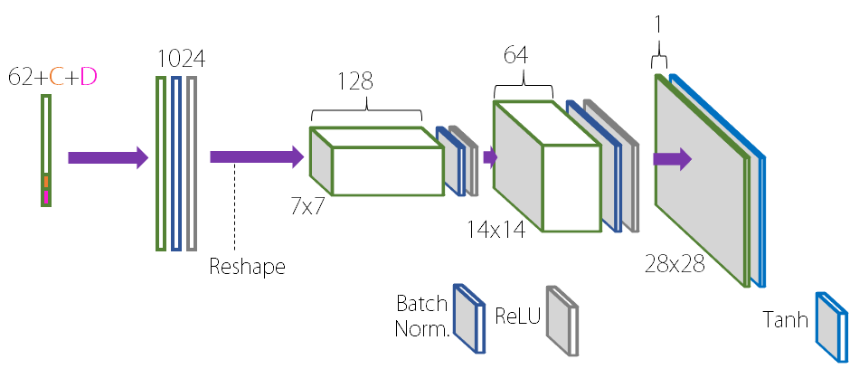
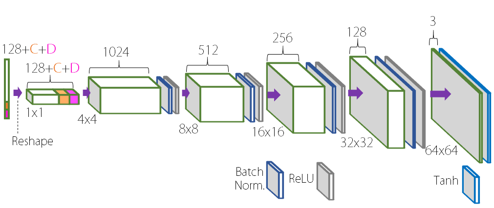

# InfoGAN in Pytorch (v 1.0)

Basic Implementation (Study friendly) of InfoGAN in Pytorch

More Information: [Original Paper](https://arxiv.org/abs/1606.03657)

About this algorithm (in Korean): [My Blog Post](https://taeoh-kim.github.io/blog/blog/generative-models-part-2-improvedganinfoganebgan/)

- GAN: [[Pytorch](https://github.com/taeoh-kim/GANin50lines)][[Tensorflow](https://github.com/HyeongminLEE/GANin50lines)]
- DCGAN: [[Pytorch](https://github.com/taeoh-kim/Pytorch_DCGAN)][[Tensorflow](https://github.com/HyeongminLEE/Tensorflow_DCGAN)]
- InfoGAN: [[Pytorch](https://github.com/taeoh-kim/Pytorch_InfoGAN)][Tensorflow]
- Pix2Pix: [[Pytorch](https://github.com/taeoh-kim/Pytorch_Pix2Pix)][[Tensorflow](https://github.com/HyeongminLEE/Tensorflow_Pix2Pix)]
- DiscoGAN: [[Pytorch](https://github.com/taeoh-kim/Pytorch_DiscoGAN)][[Tensorflow](https://github.com/HyeongminLEE/Tensorflow_DiscoGAN)]

## 1. Environments

- Ubuntu 16.04
- Python 3.6 (Anaconda)
- Pytorch 0.2.0
- Torchvision 0.1.9

## 2. Networks and Parameters

### 2.1 Hyper-Parameters

- Image Size = 28x28x1 MNIST / 64x64x3 CelebA
- Batch Size = 16
- Test Batch Size (Sample Size) = 100 (10x10)
- Learning Rate = 0.0002 for D, 0.001 for G
- Adam_beta1 = 0.5
- z_dim = 62 MNIST / 128 CelebA
- InfoGAN Continuous Code Dimension = 1
- InfoGAN Discrete Code Dimension = 10
- Continuous Code Weight = 0.1~0.5 MNIST / 1.0 CelebA
- Discrete Code Weight = 1
- Epoch = 50 MNIST / 4 CelebA

### 2.2 Generator Networks (network.py)

#### 2.2.1 MNIST

<p align="center"></p>

#### 2.2.2 CelebA

<p align="center"></p>

### 2.3 Discriminator Networks (network.py)

#### 2.3.1 MNIST

<p align="center"></p>

#### 2.3.2 CelebA

<p align="center"></p>

## 3. Run (Train)

You can modify hyper-parameter. Look at the parsing part of the code.

### 3. 1 MNIST

Train

```bash
python infogan.py
```

### 3. 2 CelebA DB (Cropped Face, 156253 Samples)

Data Download

```bash
chmod +x celebdownload.sh
./celebdownload.sh
```

Train

```bash
python infogan.py --db 'celebA' --image_size 64 --z_dim 128 --continuous_weight 1.0 --num_epochs 4
```

## 4. Test

Will be uploaded

## 5. Results

#### CelebA (4 Epochs)

Discrete(Categorical) Code adjusts personality/skin color

Continuous Code adjusts emotion (Smile)

<p align="center"></p>

#### MNIST (c_weight = 0.1, 40 Epochs)

<p align="center"></p>

#### MNIST (c_weight = 0.1, 50 Epochs)

<p align="center"></p>

#### MNIST (c_weight = 0.5, 35 Epochs)

<p align="center"></p>

#### MNIST (c_weight = 0.5, 50 Epochs)

<p align="center"></p>
